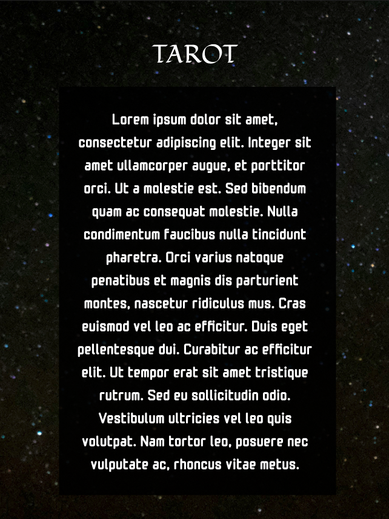

# Data lovers | Tarot


## Descripción del proyecto

Este proyecto consiste en una página web que permite visualizar un dataset con información del Tarot. 
La página web permite a los usuarios visualizar las 78 cartas del Tarot, filtrar su visualización deacuerdo por tipo de Arcano; Arcanos Mayores y Arcanos Menores. De la misma forma, el esta web permite ordenar las visualización por orden alfabético ascendente y descendente. 
Adicionalmente esta web permite al usuario acceder a una lectura abierta del tarot en donde a partir del cálculo numérico del largo del nombre, fecha de nacimiento y un algoritmo místico de randomización, devuelve al usuario una de las cartas del tarot para su  interpretación. 

## Acerca de Tarot

El tarot es una baraja de naipes a menudo utilizada como medio de consulta e interpretación de hechos (presentes, pasados o futuros), sueños, percepciones o estados emocionales que constituye, además, un tipo de cartomancia.

Sus orígenes datan al menos del siglo XIV. La técnica se basa en la selección de cartas de una baraja especial, que luego son interpretadas por una lectora, según el orden o disposición en que han sido seleccionadas o repartidas. La baraja de tarot está compuesta por 78 cartas divididas en arcanos mayores, los cuales son 22; y menores, que son 56. La palabra arcano proviene del latín arcanum, que significa 'misterio' o 'secreto'.

## Detalles de la base de datos

El dataset con el que trabajamos contiene la siguiente información. 

  - Tipo: Si es arcano mayor o menor.
  - Nombre: El nombre de cada una.
  - Nombre corto: Un código identificador de cada una.
  - Valor: Su valor numérico asociado.
  - Significado hacia arriba: El significado asociado a la carta volteada hacia arriba.
  - Significado al reverso: El significado asociado a la carta volteada al reverso.
  - Descripción de la carta: La descripción del escenario asociado a la carta.
  - Imagen: Una representación visual de la descripción de la carta.

## Historias de usuario 

El diseño de este proyecto considera proporciona a la persona usuaria cuatro posibilidades para interactuar con la información. Estas son visualizar, filtrar, ordenar y calcular. Todas ellas estan diseñadas para ser responsivas. 

Para ello primero se contemplaron 4 historias de usuario. Cada una de las cuales están almacenadas en un archivo html: 
- `index.html` Funge como "home". Tiene 3 botones. _Learn about_ que despliega más información. _Deck_ Direcciona a `baraja.html` y _Open Reading_ que direcciona a `future.html`.  

- `baraja.html` Despliega la visualización de las cartas con el contenido respectivo para cada una. Esta historia permite ordenar la información por orden alfabético y filtrarla por tipo de arcano. La función de ordenar se activa con un _toggle button_ y filtrar por _select_. Al final de la página el usuario puede presionar un botón para volver a `index.html`

- `future.html` Breve lectura de cartas abierta para el usuario.
La interacción con el usuario implica:
El usuario escribe su nombre en un recuadro de texto.
El usuario selecciona su fecha de nacimiento de lista desplegable.
El usuario da click en un botón _Read my luck_ que activa la función de calcular. La cual suma el valor númerico en ASCII del nombre, el valor la fecha y le suma un algoritmo de randomización el cual arroja un valor entre 1 y 78 (por el número de cartas). Este valor lo manda por a `luck.html`.

- `luck.html` Toma el valor númerico enviado por `future.html` que asigna al índice de alguna de las cartas y la imprime en el DOM. Contiene un botón para regresar al `index.html` y otro más para volver a probar suerte. 


## Diseño de interfaz de usuario 

El diseño fue realizado en Figma. Contemplamos una paleta de colores con mucho morado y negro para darle una sensación mística y mágica al usuario. Optamos por letras sans serif en el contenido y algo más elaborado para el título. 

## Prototipo de alta fidelidad 
Historia inicial `index.html`


Desplegable dentro de `index.html` con información sobre el tarot.  



Visualización de las cartas con la función de filtrar y ordenar. 


Lectura abierta con un formulario para capturar la información del usuario. 


Resultado del cálculo que devuelve una carta al usuario. 


## Estado del proyecto

El proyecto actualmente cuenta con todas las historias de usuario corriendo menos la referente al cálculo. Las funciones de filtrar y ordenar están en `data.js` pero ambas contienen errores. Sort no interactúa con filter y filter arroja un error. 
Quedan pendiente escribir los test, solucionar los errores, implementar la seleción de las cartas para mostrar en la historia almacenada en `luck.html` y hacer deploy. 

## Demostración de funciones y aplicaciones

Instrucciones para ejecutar el proyecto.

Clonar el repositorio
```
git clone git@github.com:MarianneTeixido/DEV010-data-lovers.git
```
Desplazarse dentro del proyecto e instalar las librerías con node.

```
cd DEV010-data-lovers
npm install
```
Montar un servidor local para ejecutar la página en una red local. 
```
npm start
```

## Acceso al proyecto

Pendiente deploy

## Tecnologías utilizadas

- HTML
- Vanilla JavaScript
- CSS (_Cascading Style Sheets_)
- Git y Github
- Figma

## Desarrolladoras del proyecto

- [Grecia Fragoso](https://github.com/GreciaFragoso)
- [Marianne Teixidó](https://marianneteixido.github.io/)

## Licencia
Este proyecto está licenciado con CC BY-NC-SA 4.0 https://creativecommons.org/licenses/by-nc-sa/4.0/