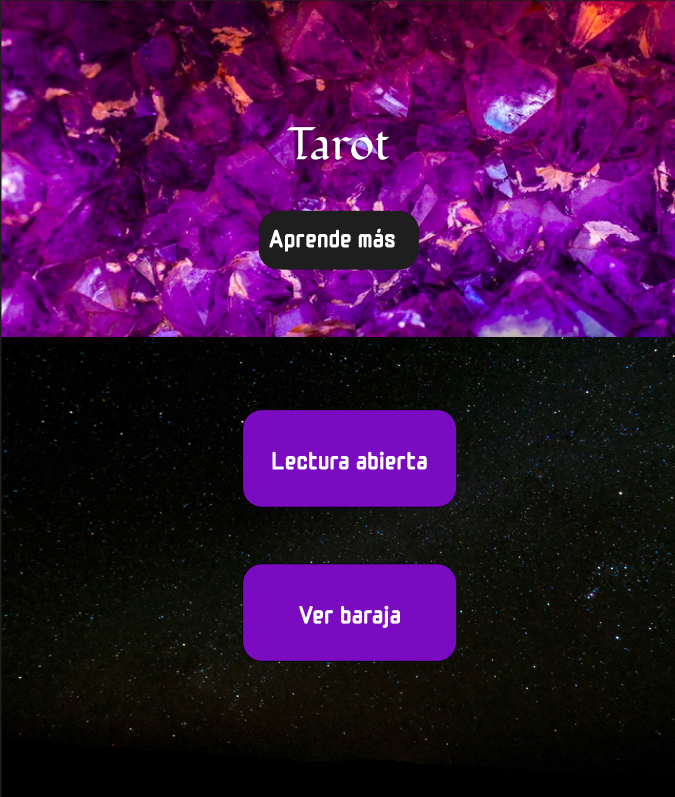
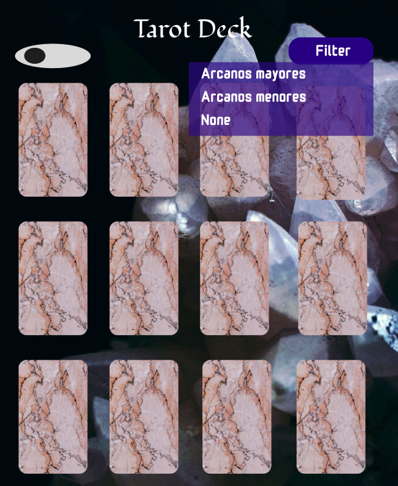
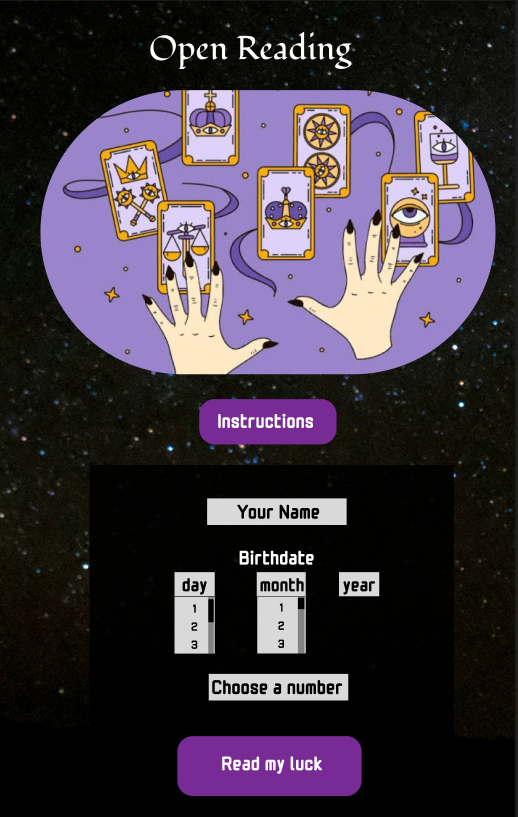
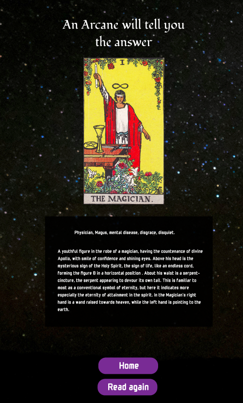

# Data lovers | Tarot


## Project Description

This project consists of a web page that allows users to visualize a dataset with Tarot information.
The web page enables users to view the 78 Tarot cards, filter their visualization by Arcana type: Major Arcana and Minor Arcana. Likewise, this web page allows sorting the visualization in ascending and descending alphabetical order.
Additionally, this web page allows users to access an open Tarot reading, where based on the numerical calculation of the name's length, date of birth, and a mystical randomization algorithm, it returns one of the Tarot cards for interpretation.

## About Tarot

Tarot is a deck of cards often used as a means of consultation and interpretation of events (present, past, or future), dreams, perceptions, or emotional states, constituting a type of cartomancy.

Its origins date back to at least the 14th century. The technique is based on the selection of cards from a special deck, which are then interpreted by a reader, according to the order or arrangement in which they have been selected or dealt. The Tarot deck consists of 78 cards divided into Major Arcana, which are 22, and Minor Arcana, which are 56. The word "Arcana" comes from the Latin "arcanum," which means 'mystery' or 'secret.'

## Database details

The dataset we are working with contains the following information:

- Type: Whether it is a Major or Minor Arcana.
- Name: The name of each card.
- Short name: An identifying code for each card.
- Value: Its associated numerical value.
- Upright meaning: The meaning associated with the card in an upright position.
- Reversed meaning: The meaning associated with the card in a reversed position.
- Card description: The description of the scenario associated with the card.
- Image: A visual representation of the card's description.

## User stories 

The design of this project provides four possibilities for interacting with the information. These are to view, filter, sort, and calculate. All of them are designed to be responsive.

For this, four user stories were considered, each of which is stored in an HTML file:

- `index.html` cts as the "home" page. It has three buttons. _Learn about_ displays more information. _Deck_  directs to `baraja.html` and _Open Reading_ directs to `future.html`.  

- `baraja.html`  Displays the visualization of the cards with the respective content for each one. This story allows sorting the information in alphabetical order and filtering it by Arcana type.  The sorting function is activated with a toggle button, and filtering is done using a select element. At the end of the page, the user can press a button to return to `index.html`

- `future.html` Brief open card reading for the user. The interaction with the user involves:
The user enters their name in a text box.
The user selects their date of birth from a drop-down list.
The user clicks a button _Read my luck_, which activates the calculation function. It sums the ASCII numerical value of the name, the date value, and adds a randomization algorithm that generates a value between 1 and 78 (the number of cards). This value is sent to `luck.html`.

- `luck.html` Receives the numerical value sent by `future.html` which corresponds to the index of one of the cards, and displays it in the DOM. It contains a button to return to `index.html` and another one to try their luck again. 


## User interface design 

The design was created using Figma. We opted for a color palette with lots of purple and black to give the user a mystical and magical feeling. We used sans-serif fonts for the content and a more elaborate font for the title. 

## High-Fidelity prototype

Initial story `index.html`



Dropdown within `index.html` with information about Tarot.  


Visualization of the cards with filtering and sorting functionalities. 



Open reading with a form to capture user information.



Result of the calculation that returns a card to the user.



## Project Status

The project currently has all user stories running, except for the one related to the calculation. The filter and sort functions are implemented in `data.js` but both contain errors. Sort does not interact with filter, and filter throws an error. There are pending tasks to write tests, fix the errors, implement the selection of cards to display in the story stored in `luck.html` and deploy the project. 

## Functions and applications demonstration

Instructions to run the project.

Clone the repository
```
git clone git@github.com:MarianneTeixido/DEV010-data-lovers.git
```
Navigate inside the project and install the required libraries using node.
You must have Node.js installed.

```
cd DEV010-data-lovers
npm install
```
Run a local server to execute the page on a local network.
```
npm start
```

## Project access

Pending deployment

## Technologies used

- HTML
- Vanilla JavaScript
- CSS (_Cascading Style Sheets_)
- Git y Github
- Node 
- Figma

## Project developers

- [Grecia Fragoso](https://github.com/GreciaFragoso)
- [Marianne Teixidó](https://marianneteixido.github.io/)

## License
This project is licensed under CC BY-NC-SA 4.0 https://creativecommons.org/licenses/by-nc-sa/4.0/